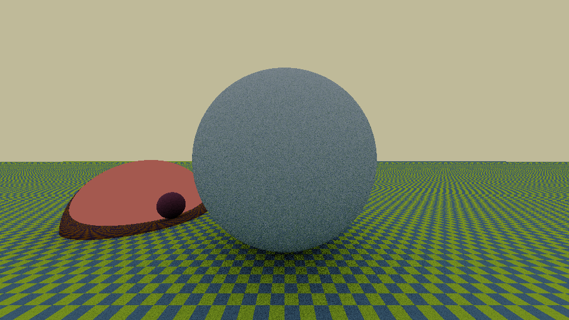

<h1 align="center">
  <br>
  <a href="https://github.com/teob97/T-RayX/"></a>
  <br>
  T-RayX
  <br>
</h1>

<h2 align="center">A <a href="https://nim-lang.org/" target="_blank">NIM</a> Raytracing Library.</h2>

<p align="center">
  <a href='https://github.com/teob97/T-RayX/releases'>
  
  </a>
  <a href='https://github.com/teob97/T-RayX/blob/main/LICENSE'>
  
  </a>
</p>

---

## :t-rex:  Overview
T-RayX: a Nim library aimed to generate a photorealistic image.

The project has been developed during the course [*Numerical techniques for photorealistic image generation*](https://www.unimi.it/en/education/degree-programme-courses/2022/numerical-tecniques-photorealistic-image-generation) held by Prof. [Maurizio Tomasi][1] at Università degli Studi di Milano (A.Y. 2021/2022)

The main functionality of this library is to generate photorealistic images from input files that describe a scene. (See more details [here](#small_orange_diamond-render)).
With T-RayX you are also able to convert PFM files to PNG using the [pfm2png](#pfm2png) command.

## :desktop_computer:  System Requirements

T-RayX works on Windows, Linux and MacOSX machine.

For a proper use of the library you need:
- [Nim](https://nim-lang.org/) version required: 1.6.4
- [Nimble](https://github.com/nim-lang/nimble) package manager
- [simplepng](https://github.com/jrenner/nim-simplepng): use ```nimble install simplepng``` to install it.
- [docopt](https://github.com/docopt/docopt.nim): use ```nimble install docopt``` to install it.
- [ffmpeg](https://ffmpeg.org/) and [GNU parallel](https://www.gnu.org/software/parallel/) just for the animations (see _scripts_ folder).

## :wrench: Download and build

You can download the latest stable release [here](https://github.com/teob97/T-RayX/releases), and unpack it
   ``` bash
   $ tar -xvf /path/to/tar #or zip file -C /path/to/your/directory
   ```
or if you want, you can clone this repository
   ``` bash
   $ git clone https://github.com/teob97/T-RayX.git
   ```
   
To generate the executable file, use:
```bash
$ nimble build -d:release
```
In some cases it is necessary to create a folder named `output` (in the project directory) to make T-RayX work proprely.

## :rocket:  Usage

You can run the following command to visualize through the CLI all the possible procedures:
```bash
$ ./trayx --help
```

### :small_orange_diamond: render

To run the render, use:

```bash
$ ./trayx render <SCENE_FILE.txt> <width> <height> [options]
```
To see all the possible options use `./trayx --help`.

<!---
|Options|Description|
|-------|-----------|
|--renderer        |Renderer's type: onoff, flat, pathtracing, pointlight. [default: pathtracing]|
|--output          |Output file.png|
|--numberOfRays    |Number of rays departing from each surface point (only applicable with pathtracing).|
|--maxDepth        |Maximum allowed ray depth (only applicable with pathtracing).|
|--initState       |Initial seed for the random number generator (positive number).|
|--initSeq         |Identifier of the sequence produced by the random number generator (positive number).|
|--samplePerPixel  |Number of samples per pixel (must be a perfect square, e.g. 2,4,16...). Used in the antialiasing. [default: 0]|
|--defineFloat     |Used to declare a new float variable. Syntax: --defineFloat=pippo:42/pluto:55/... |
--->

The input file SCENE_FILE.txt must contain the detailed description of the scene that has to be rendered. See [the next section](#page_facing_up-input-file-format)

### :small_orange_diamond: pfm2png

Convert pfm file in png image using:

```bash
$ ./trayx pfm2png <file.pfm> <alpha> <gamma> <output.png>
```

It is necessary to set specific values for alpha and gamma parameters.

### :small_orange_diamond: demo

To run the demo, use:

```bash
$ ./trayx demo
```
This will produce the following 960x540 image:
<p float="center">
  
</p>

## :page_facing_up: Input file format

## :book: Documentation

A complete documentation with all the procedures and the data structures is aviable at this [link](https://teob97.github.io/T-RayX/)

## :sunglasses: Examples

### Example 1 (pfm2png)

Run:

```bash
$ ./trayx pfm2png examples/pfm2png/lawn.pbm 0.6 1.45 examples/pfm2png/lawn_a0.6-gamma1.45.png
```

in order to create the following image:

<p float="center">
  
</p>

It is possible to tune the parameters alpha and gamma.

  |   |  
:--:|:--:|:--:|
`alpha = 0.3` | `alpha = 0.6`  |  `alpha = 0.9`


[1]: https://github.com/ziotom78
