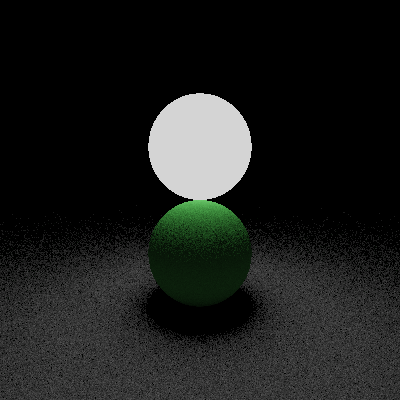

<h1 align="center">
  <br>
  <a href="https://github.com/teob97/T-RayX/"></a>
  <br>
  T-RayX
  <br>
</h1>

<h2 align="center">A <a href="https://nim-lang.org/" target="_blank">NIM</a> Raytracing Library.</h2>

<p align="center">
  <a href='https://github.com/teob97/T-RayX/releases'>
  
  </a>
  <a href='https://github.com/teob97/T-RayX/blob/main/LICENSE'>
  
  </a>
</p>

---

## :t-rex:  Overview
T-RayX: a Nim library aimed to generate a photorealistic image.

The project has been developed during the course [*Numerical techniques for photorealistic image generation*](https://www.unimi.it/en/education/degree-programme-courses/2022/numerical-tecniques-photorealistic-image-generation) held by Prof. [Maurizio Tomasi](https://github.com/ziotom78) at Università degli Studi di Milano (A.Y. 2021/2022)

The main functionality of this library is to generate photorealistic images from input files that describe a scene. (See more details [here](#small_orange_diamond-render)).
With T-RayX you are also able to convert PFM files to PNG using the [pfm2png](#pfm2png) command.

## :desktop_computer:  System Requirements

T-RayX works on Linux, MacOSX and Windows (not so sure) machine. 

For a proper use of the library you need:
- [Nim](https://nim-lang.org/) version required: 1.6.4
- [Nimble](https://github.com/nim-lang/nimble) package manager
- [simplepng](https://github.com/jrenner/nim-simplepng): use ```nimble install simplepng``` to install it.
- [docopt](https://github.com/docopt/docopt.nim): use ```nimble install docopt``` to install it.
- [ffmpeg](https://ffmpeg.org/) and [GNU parallel](https://www.gnu.org/software/parallel/) just for the animations (see _scripts_ folder).

## :wrench: Download and build

You can download the latest stable release [here](https://github.com/teob97/T-RayX/releases), and unpack it
   ``` bash
   tar -xvf /path/to/tar #or zip file -C /path/to/your/directory
   ```
or if you want, you can clone this repository
   ``` bash
   git clone https://github.com/teob97/T-RayX.git
   ```
   
To generate the executable file, use:
```bash
nimble build -d:release
```
In some cases it is necessary to create a folder named `output` (in the project directory) to make T-RayX work proprely.

## :rocket:  Usage

You can run the following command to visualize through the CLI all the possible procedures:
```bash
./trayx --help
```

### :small_orange_diamond: render

To run the render, use:

```bash
./trayx render <SCENE_FILE.txt> <width> <height> [options]
```
To see all the possible options use `./trayx --help`.

The input file SCENE_FILE.txt must contain the detailed description of the scene that has to be rendered. See [the next section](#page_facing_up-input-file-format)

### :small_orange_diamond: pfm2png

Convert pfm file in png image using:

```bash
./trayx pfm2png <file.pfm> <alpha> <gamma> <output.png>
```

It is necessary to set specific values for alpha and gamma parameters.

### :small_orange_diamond: demo

To run the demo, use:

```bash
./trayx demo
```
This will produce the following 960x540 image:
<p float="center">
  
</p>

## :page_facing_up: Input file format

To describe the scene that has to be rendered it is necessary to create a .txt file and use a specific syntax. Below are all the keywords that can be used within the input file:

| **FIGURE**  | **BRDF** | **PIGMENT** | **TRANSFORMATION** | **CAMERA_TYPE** | **_Extras_** |
|---------------|------------|---------------|----------------------|--------------|--------------|
| plane         | diffuse    | uniform       | identity             | orthogonal      | new          |
| sphere        | specular   | checkered     | translation          | perspective   | float        |
| aabox         |            | image         | rotation_x           |              | light        |
| cylinder      |            |               | rotation_y           |              | material     |
|               |            |               | rotation_z           |              | camera       |
|               |            |               | scaling              |              |              |

First thing first it is necessary to define a camera, use the following syntax:

```
camera(CAMERA_TYPE, TRANSFORMATION, aspectRatio:float, distance:float)
```
where `aspectRatio` is a float representing the ration between the width and the height (expressed in # of pixel) of the image; `distance` is a float representing the distance of the camera from the screen.

To define a space vector or a color it is necessary to specify three values:
```
[x:float, y:float, z:float] # This is a vector representing a 3D position or a direction
<r:float, g:float, b:float> # This is a vector representing a RGB color
```
The first vectors are used to define translation. Here are the ways to define the various possible transformations:
```
identity # Use this if you don't want a transformation
translation([x,y,z])
scaling([x,y,z])
rotation_x(rotation_angle:float) # Define a rotation around the x axis
rotation_y(rotation_angle:float) # Define a rotation around the y axis
rotation_z(rotation_angle:float) # Define a rotation around the z axis
```
To define a pigment use the RGB vectors:
```
uniform(<r,g,b>)
chekered(<r1,g1,b1>, <r2,g2,b2>, n_step:int)
image(image_PATH:string)
```
To define the material of the shapes that will be rendered it is necessary to use the correct BDRF:
```
material NAME(diffuse(PIGMENT), uniform(<r,g,b>)) # Diffuse brdf, the second pigment represent the emitted radiance.
material NAME(specular(PIGMENT), uniform(<0,0,0>)) # Specural brdf
```
To define a shape use this syntax:
```
FIGURE (MATERIAL, TRANSFORMATION)
```
In _pointlight_ render to define a light source use:
```
light ([x,y,z], <r,g,b>, radius:float)
```
It is also possible to define float variables:
```
float NAME(value:float)
```
You can find many examples in the [examples](./examples) folder!

## :book: Documentation

A complete documentation with all the procedures and the data structures is aviable at this [link](https://teob97.github.io/T-RayX/)

## :police_car: License

The code is released under a GPL-3.0 license. See the file [LICENSE](./LICENSE)

## :sunglasses: Examples

### Example 1 (pfm2png)

Run:

```bash
$ ./trayx pfm2png examples/pfm2png/lawn.pbm 0.6 1.45 examples/pfm2png/lawn_a0.6-gamma1.45.png
```

in order to create the following image:

<p float="center">
  
</p>

It is possible to tune the parameters alpha and gamma.

  |   |  
:--:|:--:|:--:|
`alpha = 0.3` | `alpha = 0.6`  |  `alpha = 0.9`

### Example 2 (render)

Use the following command to produce the scene described [here](examples/render/example1.txt):

```bash
./trayx render examples/render/example1.txt 400 400 --output=examples/render/example1.png --luminosity=0.4 --gamma=2 --samplePerPixel=9

```

Use the following command to produce the scene described [here](examples/render/example2.txt):

```bash
./trayx render examples/render/example2.txt 400 400 --output=examples/render/example2.png --luminosity=0.2 --gamma=2 --maxDepth=3 --samplePerPixel=9
```

Use the following command to produce the scene described [here](examples/render/example3.txt):

```bash
./trayx render examples/render/example3.txt 400 400 --output=examples/render/example3.png --samplePerPixel=9
```

  |   |  
:--:|:--:|:--:|
`example 1` | `example 2`  |  `example 3`

You can also try to generate more artistic images. For the following image, we took inspiration from an artistic work by [Jeff Koons](http://www.jeffkoons.com/artwork/celebration/balloon-dog-0).

<p float="center">
  
</p>

